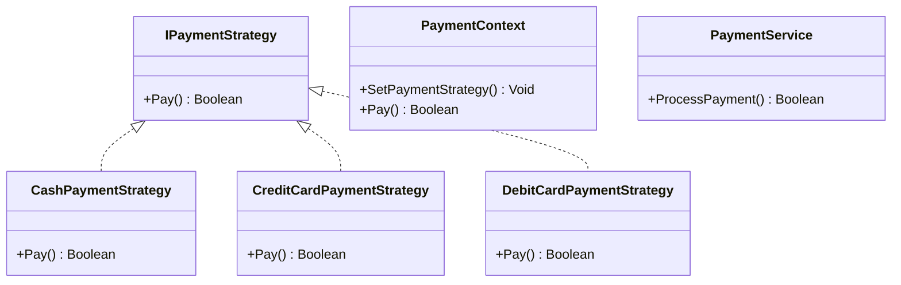

```mermaid
classDiagram

class CashPaymentStrategy
CashPaymentStrategy : +Pay() Boolean

class CreditCardPaymentStrategy
CreditCardPaymentStrategy : +Pay() Boolean

class DebitCardPaymentStrategy
DebitCardPaymentStrategy : +Pay() Boolean

class IPaymentStrategy
IPaymentStrategy : +Pay() Boolean

class PaymentContext
PaymentContext : +SetPaymentStrategy() Void
PaymentContext : +Pay() Boolean

class PaymentService
PaymentService : +ProcessPayment() Boolean


IPaymentStrategy <|.. CashPaymentStrategy
IPaymentStrategy <|.. CreditCardPaymentStrategy
IPaymentStrategy <|.. DebitCardPaymentStrategy

```
